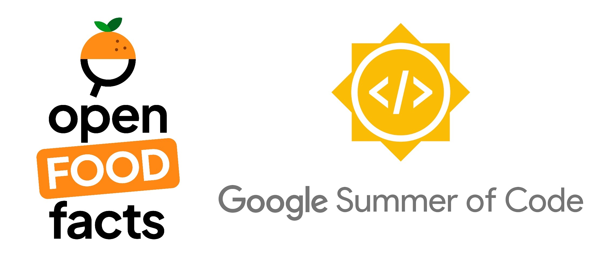

# GSoC 2022 Report

**Author**: [Aadarsh Anantha Ramakrishnan](https://github.com/aadarsh-ram)

**Organization**: [Open Food Facts](https://world.openfoodfacts.org/)

**Project**: [Build a Taxonomy Editor](https://github.com/openfoodfacts/taxonomy-editor)

**Mentors**: [Alex Garel](https://github.com/alexgarel), [Stephane Gigandet](https://github.com/stephanegigandet), [Pierre Slamich](https://github.com/teolemon), [Charles Nepote](https://github.com/charlesnepote)

## Project Description

The Open Food Facts database contains a lot of information on food products, such as ingredients, labels, additives etc. To link this information to useful properties such as Nutri-Score, Agribalyse and many more, taxonomies are used within the database.

A taxonomy in Open Food Facts is a raw text file containing a Directed Acyclic Graph (DAG) where each leaf node has one or more parent nodes. It is mainly used for classification and translation of various food products within the database. Hence, taxonomies are at the heart of data structures in the Open Food Facts database and must be maintained properly.

The taxonomy files present in Open Food Facts are long to read ([ingredients.txt](https://github.com/openfoodfacts/openfoodfacts-server/blob/main/taxonomies/ingredients.txt) taxonomy alone has around 80000 lines!) and cumbersome to edit by contributors.

This project provides an User-Friendly interface developed for editing taxonomies with ease. This tool is helpful for contributors to visualize a node's translations, properties, parents and children in a single page. The editor allows users to perform CRUD operations on the taxonomy and on the nodes present. A fast search mechanism for finding nodes within the taxonomy has also been implemented successfully.

The introduction of this Taxonomy Editor would help existing contributors edit taxonomies seamlessly and will encourage more contributions from the wonderful community of Open Food Facts.

## Completed Tasks

- Designed a brand-new architecture for the entire project by decoupling the editor from the source taxonomy files in Product Opener.
- Created a [React frontend](https://github.com/openfoodfacts/taxonomy-editor/tree/main/taxonomy-editor-frontend) with the following features:
    - Display root nodes present in a taxonomy
    - Creating and deleting new root nodes in a taxonomy
    - Listing and updating different translations, properties, parents and children of a node in a taxonomy
    - Searching nodes across different translations
    - Importing taxonomies directly from GitHub and ability to start a new project
- Implemented a [Python API](https://github.com/openfoodfacts/taxonomy-editor/tree/main/backend) (created using FastAPI) to interface with the frontend and perform database operations in Neo4J.
- Helped in creating a [specification](https://github.com/openfoodfacts/taxonomy-editor/blob/main/doc/references/taxonomy-parser.md) for parsing a Taxonomy text file.
- Reviewed [parser and converter programs](https://github.com/openfoodfacts/taxonomy-editor/tree/main/parser) written in Python for conversion of a taxonomy from a raw text file to Neo4J.
- Reviewed and created Docker related files for setting up the project in development and production.

## Ongoing and Future Tasks
The Taxonomy Editor is an MVP, which can gauge community interest and can bring a lot more taxonomy contributions for Open Food Facts. All the core features required by a contributor to edit a taxonomy, have been implemented within the given time frame. Some of the features related to integration with GitHub are being fine-tuned.
 
We have a lot of scope for the next phase of this Project in converting the MVP to a full-blown version. I have documented the same in [GitHub]((https://github.com/openfoodfacts/taxonomy-editor/issues)) within the project.

## Challenges and Takeaways
- I have invested a good amount of time during the project start for developing understanding on the overall architecture and tech stack for the Taxonomy Editor. Thanks to my mentors, with their mentorship and guidance, I was able to move faster with the deliverables of the project.
- One of the most exciting parts of this project were my learnings on time management. I have to manage my priorities between my college classroom sessions, semester exams, hackathons and projects. My mentors were supportive throughout and helped me to complete all the planned deliverables with quality.
- Before GSoC, I had very little knowledge on developing websites with React. Through this project, I was able to use React effectively to build many complex and reusable components for the Taxonomy Editor. I enjoyed the learning process of a new tool.
- Being a Pythonista, I love creating new programs/tools using Python. This project helped me learn a lot about the creation of asynchronous API's and integrating them with database transactions to enable concurrency.
- Since taxonomies are essentially DAGs at its base, me and my mentors decided on using Neo4j as the database for the editor. Even though I hadn't used Neo4j, I was surprised by the user-friendliness of the Cypher Query Language and was able to create complex queries in no time!
- My code quality and documentation ability has improved drastically, thanks to detailed reviews from mentors over the course of this project.

## Acknowledgements
I'd like to thank all my mentors for helping me throughout this project. A special shoutout to [Alex Garel](https://github.com/alexgarel) and [Daniel T](https://github.com/nobeeakon), for their comprehensive code reviews and guidance. I would also like to thank [Bryan Han](https://github.com/BryanH01) for his work on the creation of the parser and other components related to it.

Contributing to Open Food Facts has been amazing, and I am looking forward to contributing more in the future! I am glad to have worked with the amazing set of people in Open Food Facts. I am extremely thankful to Google Summer of Code for providing me with this opportunity to enhance my programming skills and learn a lot about open-source development along the way.

## Pull Requests

### **Pre-GSoC**
### folksonomy_api
- #86 - [fix: "Barcode limit: 13 digits or more?"](https://github.com/openfoodfacts/folksonomy_api/pull/86)

### openfoodfacts-python
- #88 - [feat: Automatic release to PyPI + fix: failing flake8 tests](https://github.com/openfoodfacts/openfoodfacts-python/pull/88)
- #89 - [fix: Automate PyPI workflow](https://github.com/openfoodfacts/openfoodfacts-python/pull/89)
- #90 - [build: Generate automatic documentation](https://github.com/openfoodfacts/openfoodfacts-python/pull/90)
- #92 - [fix: Dependabot error during CodeQL workflow + fix: Disable labeler on forks](https://github.com/openfoodfacts/openfoodfacts-python/pull/92)
- #94 - [build: Package for Conda](https://github.com/openfoodfacts/openfoodfacts-python/pull/94)
- #99 - [build: Changed branch for release-please](https://github.com/openfoodfacts/openfoodfacts-python/pull/99)
- #101 - [docs: Rework documentation in README.md](https://github.com/openfoodfacts/openfoodfacts-python/pull/101)
- #102 - [docs: Update PR template](https://github.com/openfoodfacts/openfoodfacts-python/pull/102)

### **GSoC**
### taxonomy-editor
- #9 - [docs: Update README.md](https://github.com/openfoodfacts/taxonomy-editor/pull/9)
- #10 - [feat: Setup basic FastAPI project](https://github.com/openfoodfacts/taxonomy-editor/pull/10)
- #19 - [fix: Changed JSON according to spec](https://github.com/openfoodfacts/taxonomy-editor/pull/19)
- #26 - [feat: New paths for backend API](https://github.com/openfoodfacts/taxonomy-editor/pull/26)
- #35 - [feat: Add GET paths for parents and children + fix: Update Neo4J query](https://github.com/openfoodfacts/taxonomy-editor/pull/35)
- #41 - [feat: Add CRUD features for entries and root nodes](https://github.com/openfoodfacts/taxonomy-editor/pull/41) 
- #42 - [feat: Add home screen](https://github.com/openfoodfacts/taxonomy-editor/pull/42)
- #43 - [feat: All entries page + Navbar](https://github.com/openfoodfacts/taxonomy-editor/pull/43)
- #44 - [feat: Initialize edit entry page](https://github.com/openfoodfacts/taxonomy-editor/pull/44) 
- #45 - [feat: List all properties of an entry](https://github.com/openfoodfacts/taxonomy-editor/pull/45)
- #46 - [feat: Edit synonyms, stopwords page](https://github.com/openfoodfacts/taxonomy-editor/pull/46)
- #47 - [feat: Display parents and children of an entry](https://github.com/openfoodfacts/taxonomy-editor/pull/47)
- #74 - [fix: Error while updating a node (backend)](https://github.com/openfoodfacts/taxonomy-editor/pull/74)
- #76 - [feat: New paths for API](https://github.com/openfoodfacts/taxonomy-editor/pull/76)
- #86 - [build: Change parser workflow](https://github.com/openfoodfacts/taxonomy-editor/pull/86)
- #91 - [feat: Search functionality - Backend](https://github.com/openfoodfacts/taxonomy-editor/pull/91)
- #92 - [feat: Search functionality - Frontend](https://github.com/openfoodfacts/taxonomy-editor/pull/92) 
- #93 - [fix: Using Neo4J transactions](https://github.com/openfoodfacts/taxonomy-editor/pull/93)
- #97 - [fix: Change session to transactions](https://github.com/openfoodfacts/taxonomy-editor/pull/97)
- #100 - [fix: Add UUIDs after fetching node](https://github.com/openfoodfacts/taxonomy-editor/pull/100)
- #101 - [fix: Add multiple labels in backend](https://github.com/openfoodfacts/taxonomy-editor/pull/101) 
- #102 - [fix: Add score > 0 condition for search](https://github.com/openfoodfacts/taxonomy-editor/pull/102)
- #103 - [fix: Update requirements.txt for backend](https://github.com/openfoodfacts/taxonomy-editor/pull/103)
- #104 - [feat: Add new endpoint for fetching root nodes](https://github.com/openfoodfacts/taxonomy-editor/pull/104)

## Thank you [Open Food Facts](https://world.openfoodfacts.org/) for a amazing summer of code!